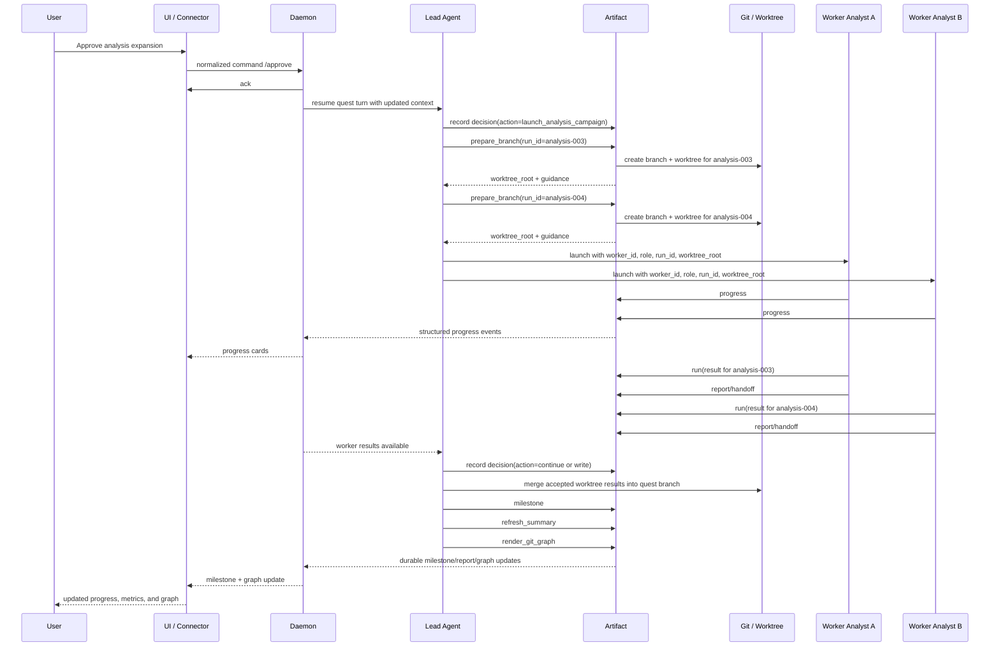

# Team Lifecycle

This document defines the reserved multi-agent lifecycle for `DeepScientist Core`.

It does **not** require that v1 ship a full multi-agent runtime.
It exists so the first implementation does not block future team execution.

The key idea is:

- one authoritative quest session
- one lead agent controlling quest-level planning
- zero or more worker agents running in isolated worktrees
- shared memory through the same `memory` tool
- durable collaboration through artifacts and handoffs

## 1. Non-negotiable rules

- the quest remains the unit of truth
- the quest root remains:
  - `~/DeepScientist/quests/<quest_id>/`
- workers do not create durable state outside:
  - their assigned worktree
  - or their assigned run directory
- workers do not rely on hidden in-memory peer state
- the lead agent decides whether worker outputs are accepted and promoted
- UI and connectors continue to use the same quest snapshot and event stream

## 2. Reserved identifiers

Every worker-capable run should reserve:

- `worker_id`
- `agent_role`
- `run_id`
- `parent_run_id`
- `worktree_root`
- `branch`

Recommended worktree root:

```text
<quest_root>/.ds/worktrees/<run_id>/
```

## 3. Sequence diagram



## 4. Lifecycle stages

### 4.1 Lead-only stage

The lead agent:

- reads the quest snapshot
- reads memory and artifact summaries
- decides whether parallel work is justified
- records the branching decision with a reason

The lead should not spawn workers unless parallelism is genuinely useful.

### 4.2 Worker preparation stage

The system prepares:

- branch
- worktree
- worker session context
- runner-visible skills
- quest-local memory and artifact access

Injected worker context should include:

- `quest_root`
- `run_id`
- `worker_id`
- `agent_role`
- `worktree_root`
- `parent_run_id`
- `team_mode`

## 4.3 Worker execution stage

Each worker may:

- read quest-local memory
- read global memory
- read existing artifacts
- write progress artifacts
- write run artifacts
- write report or handoff artifacts
- checkpoint through `artifact`

Each worker should avoid:

- directly merging its own results into the quest branch without lead approval
- creating undocumented shared state
- sending durable outputs outside its assigned scope

### 4.4 Lead review stage

The lead agent reviews worker outputs through:

- handoff artifacts
- run artifacts
- reports
- linked files under the worker run directory or worktree

The lead then records a new decision:

- accept and merge
- request another worker pass
- archive the branch
- move the quest to write or finalize

### 4.5 Promotion stage

Accepted worker results should be promoted by:

1. merging or copying accepted outputs into quest-visible state
2. writing a milestone artifact
3. refreshing `SUMMARY.md`
4. rendering the Git graph
5. notifying UI and connectors

## 5. Storage contract

Recommended worker-visible durable paths:

```text
<quest_root>/
  .ds/
    worktrees/
      analysis-003/
      analysis-004/
  experiments/
    analysis/
      campaign-002/
        analysis-003/
        analysis-004/
  artifacts/
    runs/
    reports/
    milestones/
    decisions/
```

Recommended rule:

- worktree content is the working surface
- quest artifact paths are the durable coordination surface

## 6. UI and connector implications

The UI should not need a second team-specific API.

Instead:

- `quest_snapshot` may expose reserved `team` metadata
- the event stream may carry optional `worker_id` and `agent_role`
- the web UI may show:
  - active worker count
  - active worktree count
  - worker-specific progress cards
- connectors should still receive concise quest-level summaries by default

QQ and other connectors should not be forced to understand all worker details.
They should mainly receive:

- quest-level milestones
- concise progress summaries
- decision cards

## 7. Why this stays small

This design keeps the core small because:

- the daemon still owns one quest session model
- workers are isolated by Git/worktree and file contracts
- collaboration happens through artifacts rather than opaque agent chat meshes
- the same memory, artifact, UI, and connector contracts continue to work

This follows the spirit of:

- `nanoclaw` for minimal routing and registry design
- `openclaw` for explicit plugin and registration boundaries

## 8. References

- `docs/WORKFLOW_AND_SKILLS.md`
- `docs/CORE_ARCHITECTURE.md`
- `docs/MEMORY_AND_MCP.md`
- `/ssdwork/deepscientist/_references/nanoclaw/src/channels/registry.ts`
- `/ssdwork/deepscientist/_references/nanoclaw/src/group-queue.ts`
- `/ssdwork/deepscientist/_references/openclaw/src/context-engine/registry.ts`
- `/home/air/DeepScientist_latest/DS_2027/cli/core/meta/agents/pi.md`
- `/home/air/DeepScientist_latest/DS_2027/cli/core/meta/agents/analysis-experimenter.md`
